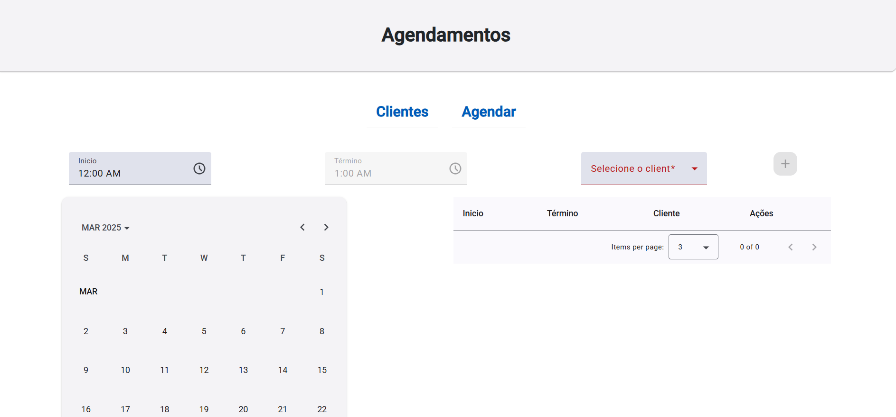
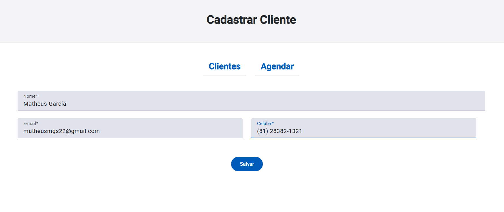

# Projeto Barber Shop

### 📍 Sobre o Projeto

Projeto Barber Shop desenvolvido durante o Bootcamp Decola Tech 2025.

O projeto tem como objetivo criar um aplicativo Full-Stack para agendamentos em uma barbearia, utilizando Java no backend, PostgreSQL no banco de dados e Angular no frontend.

---

### 🛠️ Tecnologias Utilizadas

|  |
|-------------|
| <a href="https://angular.io/"></a><a href="https://www.typescriptlang.org/"></a><a href="https://sass-lang.com/"></a><a href="https://www.java.com/"></a></a>

---

### ✅ Funcionalidades

- [x] **Cadastro de clientes**
- [x] **Listagem de clientes**
- [x] **Edição de informações do cliente**
- [x] **Agendamento com horário**

---

## 🖼️ Imagens do Projeto

### Tela de Agendamento

Esta é a tela onde os usuários podem visualizar e agendar horários para os serviços oferecidos pela barbearia. A interface é simples e intuitiva, permitindo uma experiência fluída para o usuário.

### Tela de Cadastro

Nesta tela, os administradores podem cadastrar novos clientes, inserindo suas informações como nome, email e telefone. É possível gerenciar os dados de forma rápida e eficiente.

---

### ▶️ Instruções de Uso

Antes de começar, certifique-se de ter os seguintes requisitos instalados:
- [Node.js](https://nodejs.org/en/download/)
- [Angular CLI](https://angular.io/cli)

#### 1️⃣ Clone o Repositório
```sh
  git clone https://github.com/matheusmgs22/angular-barber-shop.git

```

#### 2️⃣ Acesse a Pasta do Frontend
```sh
  cd barber-shop-ui
```

#### 2️⃣ Instale as Dependências
```sh
  npm install
```

#### 3️⃣ Execute a Aplicação
```sh
  ng serve
```

A aplicação estará disponível em `http://localhost:4200/`.

---

### 🎯 Conclusão

Este projeto foi desenvolvido como parte do Bootcamp Decola Tech 2025. Foi uma excelente oportunidade para aplicar e consolidar meus conhecimentos em Angular e Java.

Agradeço à DIO e à Avanade pelo bootcamp, que me proporcionou um aprendizado valioso e prático.

---
